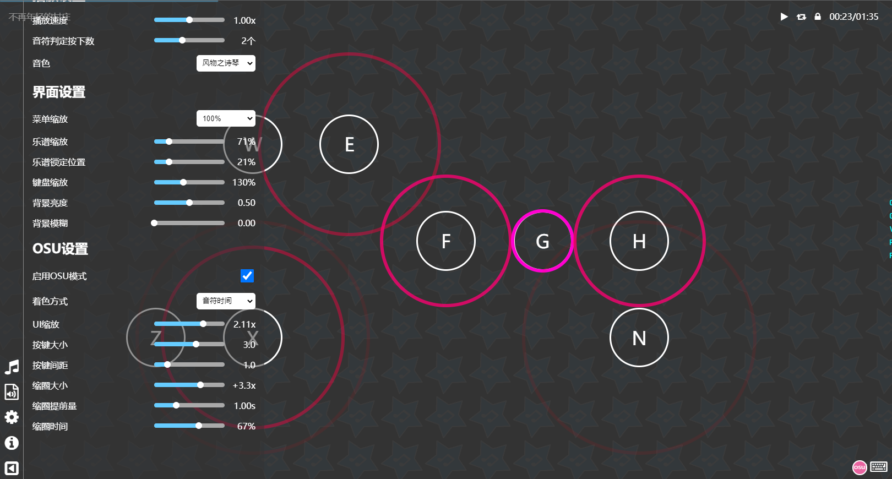
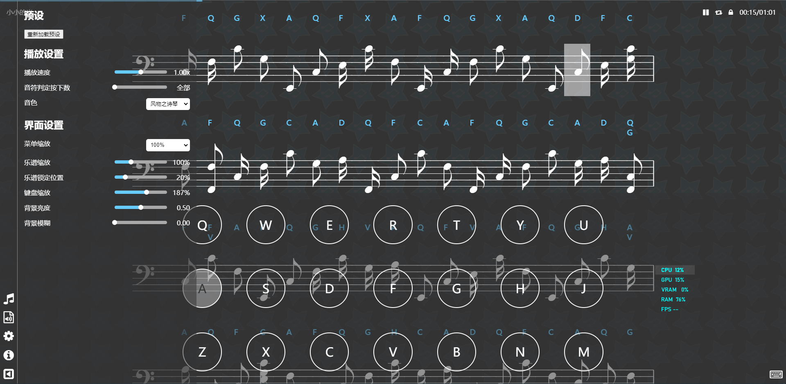

## PCK读取器

[页面地址](pck-reader)  
此工具用于读取由wwise打包的PCK音频文件，支持在线播放，也支持下载已解析的wav音频。  

## 风物之诗琴

[页面地址](windsong)  
风物之诗琴网页版  
可以根据乐谱自动演奏，也可以练习按键演奏  
内置几首预设音乐，欢迎欣赏

### osu!模式

暂停状态下可以点击圈圈或按下键盘进行练习（建议设置音符判定数为1）

### 五线谱模式

### PWA支持(小程序)
使用支持`PWA`的浏览器打开页面，如`Chrome`、`Edge`、`Firefox`、`Kiwi`、`Safari`等，点击地址栏的安装按钮。 
  
移动端点击页面底部安装提示或菜单栏安装选项，然后等待其安装并添加至主屏幕，之后从主屏幕打开会自动进入全屏横屏模式。
  

### MIDI支持
当前支持MIDI导入，以下提供两首测试音乐  
[我和你](assets/sounds/我和你.mid) (C=60)  
[柳轻颂 - 学猫叫 (钢琴版)](assets/sounds/%E6%9F%B3%E8%BD%BB%E9%A2%82%20-%20%E5%AD%A6%E7%8C%AB%E5%8F%AB%20(%E9%92%A2%E7%90%B4%E7%89%88).mid) (C=67)  

### 预设音乐
[我和你](windsong/#/song/我和你)  
[柳轻颂 - 学猫叫 (钢琴版)](windsong/#/song/柳轻颂%20-%20学猫叫%20(钢琴版))  
[Astronomia](windsong/#/song/AstronomiaV2)  
[Astronomia V3](windsong/#/song/AstronomiaV3)  
[海祇岛BGM](windsong/#/song/海祇岛V2)  
[华散之缘](windsong/#/song/华散之缘V2)  
[勾指起誓](windsong/#/song/勾指起誓)  
[皎洁的笑颜](windsong/#/song/皎洁的笑颜)  
[皎洁的笑颜 V2](windsong/#/song/皎洁的笑颜V2)  
[君の名は](windsong/#/song/君の名は)  
[不再年轻的村庄](windsong/#/song/不再年轻的村庄)  
[三葉のテーマ](windsong/#/song/三葉のテーマ)  
[同伴的力量](windsong/#/song/同伴的力量)  
[希望的明日](windsong/#/song/希望的明日)  
[小小的光](windsong/#/song/小小的光.sim)  
[星茶会](windsong/#/song/灰澈%20-%20星茶会V2)  
[雪掩的往事](windsong/#/song/雪掩的往事)  

若预设音乐没有在播放列表中出现，可以点击设置里的重新加载预设按钮